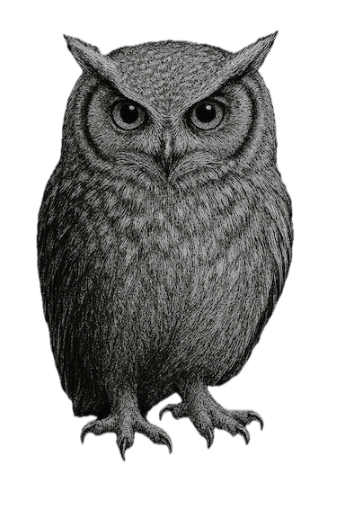

# Project Ainu Kamuichika

<p align="center">
   
</p>


This project, named after Kamuichika—the Owl God of the [Ainu](https://en.wikipedia.org/wiki/Ainu_people) people, guardian of people and villages, and the spirit who first chants in the Ainu shin'yōshū—stands as a bridge between tradition and the ever-advancing era. 

Inspired by the words of [Yukie Chiri](https://en.wikipedia.org/wiki/Chiri_Yukie) (1903–1922), who wrote: “However, one day, two or three strong individuals among us will arise and walk alongside the ever-advancing era. That day will eventually come. This is our urgent wish. This is our prayer for day and night.”

Now, as Ainu language and culture walk hand in hand with Artificial Intelligence, this project seeks to honor the past and embrace the future. Through the wisdom of Kamuichika and the power of AI, we strive to nurture, protect, and renew the stories, chants, and voices of the Ainu people.

Our purpose is to explore how AI can be used for research and preservation of Ainu culture, and to create translations that are not only accurate, but poetic and elegant — so that the soul of the Ainu may continue to sing, and the prayers of day and night may echo in new generations.

This project provides an advanced translation agent for Ainu chants, focusing on Japanese, Chinese, and English. It automates the translation process, ensuring high-quality, poetic, and accurate translations for both main stories and footnotes of Ainu oral literature, always with a human-in-the-loop for the final touch.

這個項目名為 “Project Ainu Kamuichika”，在[愛努](https://zh.wikipedia.org/wiki/%E9%98%BF%E4%BC%8A%E5%8A%AA)（或譯阿伊努）族的神謠裏，貓頭鷹神 Kamuichik 守護著村落與族人。Kamuichik 亦是《阿伊努神謠集》首位吟唱的神靈。祂如同一座橋樑，連接傳統與不斷前進的時代。

靈感源自[知里幸惠](https://zh.wikipedia.org/wiki/Chiri_Yukie) (1903–1922) 於《阿伊努神謠集》的序言：「但總有一天，如果能出現兩三位堅強的族人，與不斷前進的時代並肩前行的日子，也終將到來吧。這確實是我們迫切的願望，我們日夜為此祈禱。」

如今，愛努語言文化正與人工智慧攜手並行。項目以 Kamuichika 的智慧與 AI 的力量，守護、滋養並再生愛努族人的故事、歌謠與聲音。

項目的宗旨是探索 AI 如何用於愛努文化的研究與保存，並創造既精確又詩意優雅的譯文 —— 讓愛努的靈魂得以繼續歌唱，讓日夜的祈禱在新世代中迴響。

項目提供愛努神謠的 AI 翻譯代理，聚焦日語、中文與英語。它自動化翻譯流程，確保主故事與註腳皆能獲得高品質、詩意且精確的譯文，並始終由人類審定。


## Techniques & Approach

The workflow below describes how automated drafts are produced, compared, and refined into a single translation for human review. It highlights the automated passes, selection and enhancement stages, and where human judgment enters the process.

Here are the steps:

1. Generate drafts — LLM agents run single-direction translation passes: Japanese → Chinese; Japanese → English; English → Chinese; Chinese → English.
2. Reflect & score — a reflection agent compares versions for fidelity, readability, and poetic flow.
3. Enhance — an enhancement agent recombines the strongest phrasings into a single improved draft.
4. Template & log — outputs are written to standardized JSON/Markdown templates and logged by the notebooks.
5. Human review — translators review, edit, and finalize translations for accuracy and cultural sensitivity.

For further details, pleae refer to `translation_agent_adk/README.md`.

## File Structure

```
project_ainu_kamuichika
├─ AgenticTranslation_workflow_adk_main_text.ipynb
│   — Notebook for main-text translation experiments and runs.
├─ AgenticTranslation_workflow_adk_footnotes.ipynb
│   — Notebook for generating and editing footnotes/annotations.
├─ AgenticTranslationOutput_adk_main_text/     — Generated main-text outputs (markdown/JSON).
├─ AgenticTranslationOutput_adk_footnotes/     — Generated footnotes and annotation artifacts.
├─ Chiri_Japanese_Translation/                 — Project-specific Japanese source texts and drafts.
├─ Chiri_footnotes/                            — Footnote drafts and notes for Chiri texts.
├─ templates/
│  ├─ updated_output_md_template               — Markdown template for standardized outputs.
│  └─ updated_footnotes_md_template             — Template for footnotes and annotation blocks.
├─ utils/
│  └─ md_to_html_json.py                        — Helper: convert markdown to HTML + JSON metadata.
├─ original_Ainu_text/                         — Scanned/transcribed original Ainu source texts.
├─ Manual_updated_Translation/
│  ├─ Chinese_Translation/                      — Human-edited Chinese translations.
│  └─ English_Translation/                      — Human-edited English translations.
└─ translation_agent_adk/
   ├─ agent.py                                 — Core agent orchestration and run logic.
   ├─ prompt.py                                — Prompt templates and prompt-building utilities.
   ├─ config.py                                — Configuration and runtime settings.
   ├─ schema.py                                — Data schemas for outputs and exchanges.
   └─ .env                                     — Environment variables (API keys, model selection).
```

Web Reader
-------------------

A web reader is available for reading the current human-edited translations on Project's GitHub Pages: https://ytyeung.github.io/project_ainu_kamuichika/.

Licensing
---------

**Textual Content:**
All translations, and story-related textual content are licensed under the [CC BY-NC-ND 4.0 Attribution-NonCommercial-NoDerivatives 4.0 International](https://creativecommons.org/licenses/by-nc-nd/4.0/) license. You may share the content with attribution, but not use it commercially or create derivative works.

**Code:**
All source code and prompts in this repository is licensed under the [Apache License 2.0](https://www.apache.org/licenses/LICENSE-2.0).

See `LICENSE.txt` for full license details.

References
----------

Primary sources and references:

1. The source of Ainu transliteration and Japanese translations by Chiri Yukie:
- 知里幸恵 編訳『アイヌ神謡集』郷土研究社〈炉辺叢書〉、1923（大正12）年8月10日。 [青空文庫](https://www.aozora.gr.jp/cards/001529/card44909.html)
- 知里幸恵 編訳『アイヌ神謡集』岩波書店〈岩波文庫〉、1978（昭和53）年8月16日（2016年12月6日第56刷）。

2. English Translation Reference:
- Strong, Sarah M. *Ainu Spirits Singing: The Living World of Chiri Yukie's Ainu Shin'yoshu*. University of Hawai'i Press, 2011.
- Chiri, Yukie and Benjamin Peterson. *The Song the Owl God Sang: The Collected Ainu Legends of Chiri Yukie*. BJS Books, 2013. [[Amazon]](https://www.amazon.com/The-Song-Owl-God-Sang/dp/099260060X)

3. Chinese Translation Reference:
- 知里幸惠 编译，译言古登堡计划 译，《阿依努神谣集》，中信出版集团，2018年5月10日。
- 知里幸惠 编译，马长城 译，《阿依努神谣集》，中国戏剧出版社，2024年7月。

Contact
----------------------

Please use the discussions function of the Project's GitHub.
